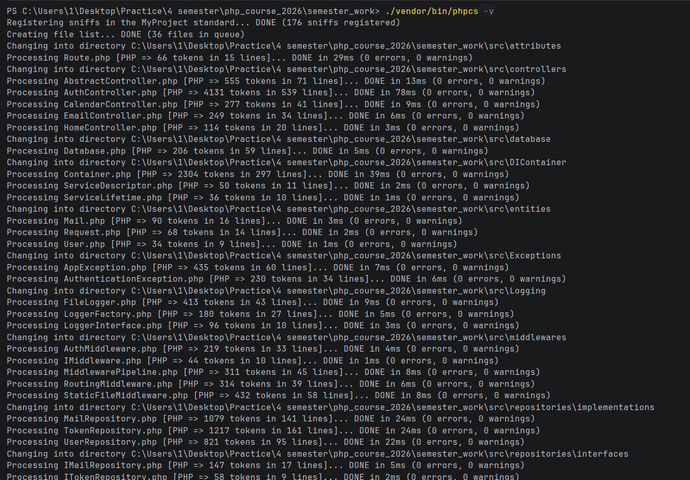
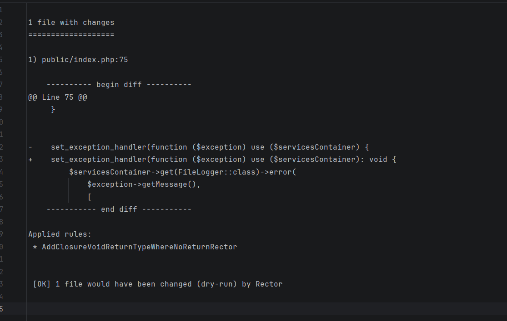
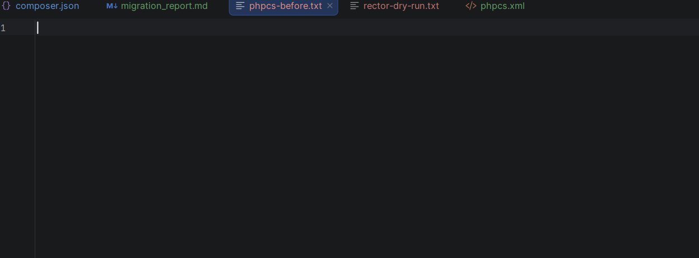
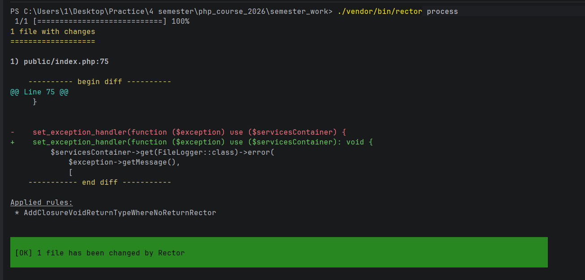
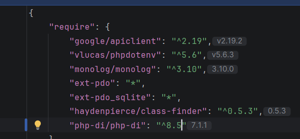

# Отчёт о миграции на PHP 8.5
Проверка phpcs


Rector
``` ./vendor/bin/rector process --dry-run > rector-dry-run.txt           ```


```./vendor/bin/phpcs src/  public/ --standard=PHPCompatibility --runtime-set testVersion 8.5- -s > phpcs-before.txt```


```./vendor/bin/rector process```


